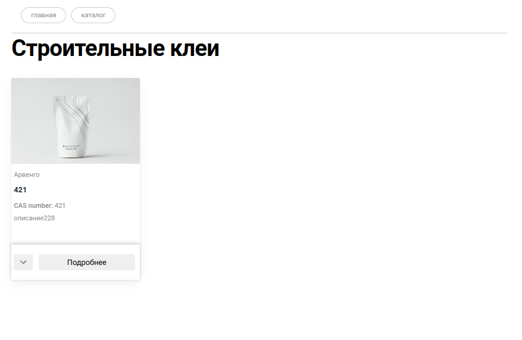
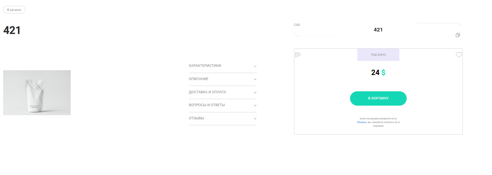

# Spring & GraphQL


## Обоснование выбора GraphQL

Есть несколько страниц с отображением одного и того же товара, однако с разной информацией на ней.




С одной стороны, никаких проблем с этим нет, однако при большом количестве данных будет страдать производительность. Можно, используя REST, создать два разных DTO, и проблема вроде решена, однако количество DTO сущностей зависит от количества страниц с выводом информацией о продукции:

```java
public class ProductCatalogDTO {

  private String commonName;

  private String description;

  private String casNumbers;

  private String companyName;

  //Getters & Setters
}
```

```java
public class ProductPageDTO {

  private String commonName;

  private String description;

  private String casNumbers;

  private String companyName;

  private int price;

  //Another fields, Getters & Setters
}
```

Тут на помощь приходит GraphQL, который решает проблемы с предоставлением только нужной информации со своим языком запросов, например:

```graphql
query {
  products {
    commonName
    description
    companyName
    casNumbers
  }
}
```

Или

```graphql
query {
  product(ARGUMENT) {
    commonName
    description
    casNumbers
    companyName
    casNumbers
    price
  }
}
```

Очевидно, что это удобная вещь, которая помогает не создавать ненужные методы или POJO классы.
